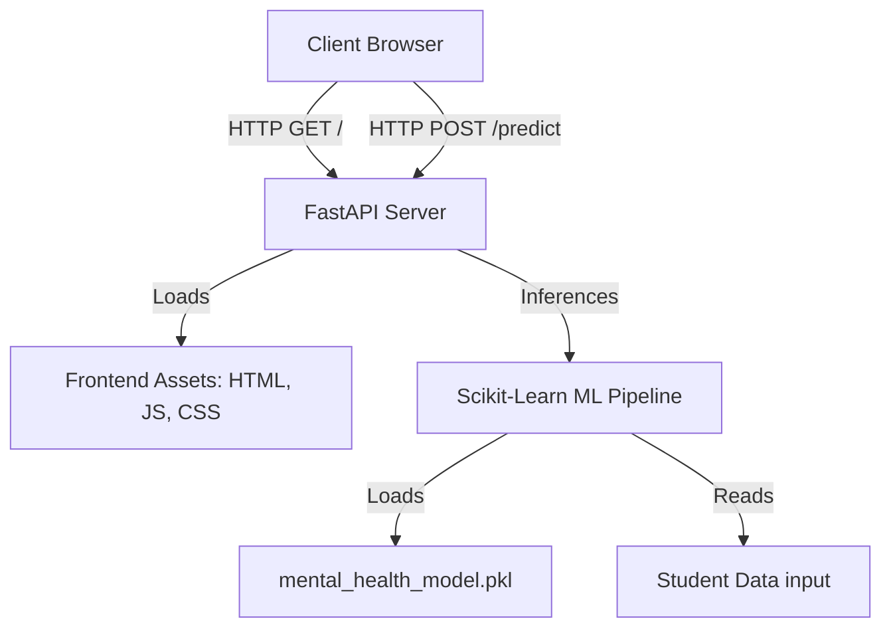

# Mental Health Signal — Student Wellness Analytics

A fully self-contained web application and machine learning API that predicts a student's mental health score (0–10) based on their daily habits, lifestyle factors, screen time, and perceived stress level. 

---

## 🏗️ Architecture

The project is designed with a lightweight, secure, and modern **single-service architecture** where the FastAPI backend serves both the machine learning prediction endpoint and the frontend web user interface.



### Key Architectural Features
- **Secure Asset Serving**: Only public files (`index.html`, `script.js`, and `style.css`) are served by the FastAPI backend. Sensitive internal files (such as `main.py`, the training dataset, or the binary `.pkl` model file) are isolated and protected from public access (returning `404 Not Found`).
- **Dynamic API Resolution**: The frontend script automatically adapts to its environment. If opened locally as a raw file (`file:` protocol), it connects to `http://127.0.0.1:2200`. If served over HTTP/HTTPS, it utilizes relative routing (`""`), meaning it will dynamically query whichever domain it is hosted on without needing hardcoded hostnames.
- **Robust Input Handling**: The backend maps the raw user country string case-insensitively and maps common variations (e.g. "usa", "united states" -> "USA") to align with the training dataset's top categories, defaulting unrecognized countries to "Other" to prevent ML model pipeline crashes.

---

## 🛠️ Tech Stack

### Frontend (Client)
- **HTML5 & CSS3**: Responsive glassmorphism layout, featuring animated SVG dials, dynamic gauges, custom tick layouts, and state management (idle, loading, result, and error screens).
- **JavaScript (ES6+)**: Custom form validations, state handling, and fetch requests.

### Backend (Server)
- **FastAPI**: Fast, asynchronous Python web framework for creating endpoints and serving files.
- **Uvicorn**: High-performance ASGI web server.
- **Pydantic**: Data validation and settings management using Python type annotations.

### Machine Learning
- **Scikit-Learn**: Machine learning pipeline featuring a `RandomForestRegressor`.
  - *Skewed numerical preprocessor*: Log-transform (`log1p`) + `StandardScaler` (e.g. for `Study_Hours`).
  - *Regular numerical preprocessor*: `StandardScaler` (e.g. for `Age`, `Avg_Daily_Usage_Hours`, `Daily_Unlocks`, `Physical_Activity_Hours`, `Sleep_Hours_Per_Night`).
  - *Ordinal preprocessor*: `OrdinalEncoder` mapping `Stress_Level` (`Low` ➔ `Medium` ➔ `High` ➔ `Very High`).
  - *Categorical preprocessor*: `OneHotEncoder` (with `handle_unknown='ignore'`) mapping `Gender`, `Academic_Level`, `Most_Used_Platform`, `Purpose_Of_Use`, and `grouped_country`.
- **Joblib**: Used to serialize and deserialize the trained scikit-learn model pipeline.
- **Pandas**: Data manipulation for model input structure.

---

## 📁 Project Structure

```text
├── Student_Social_Media_And_Mental_Health_Impact_dataset.csv  # Training dataset
├── index.html                  # Frontend layout
├── script.js                   # Client-side form handlers & SVG animations
├── style.css                   # Layout styles and custom transitions
├── main.py                     # FastAPI application endpoints & routing
├── mental_health_model.pkl     # Serialized Scikit-Learn pipeline
├── model.ipynb                 # Jupyter notebook containing training process
├── requirements.txt            # Python environment dependencies
└── .gitignore                  # Git exclude rules (caches, secrets, etc.)
```

---

## 🚀 How to Run Locally

### 1. Prerequisites
Ensure you have Python 3.10+ installed.

### 2. Install Dependencies
Clone the repository, open your terminal in the project directory, and run:
```bash
pip install -r requirements.txt
```

### 3. Start the Server
Run the FastAPI app using Uvicorn on port `2200`:
```bash
uvicorn main:app --port 2200 --reload
```

### 4. Access the Application
Open your web browser and navigate to:
```text
http://127.0.0.1:2200/
```
*(Alternatively, you can open the `index.html` file directly in your browser, and it will communicate with the backend server running on port 2200).*

---

